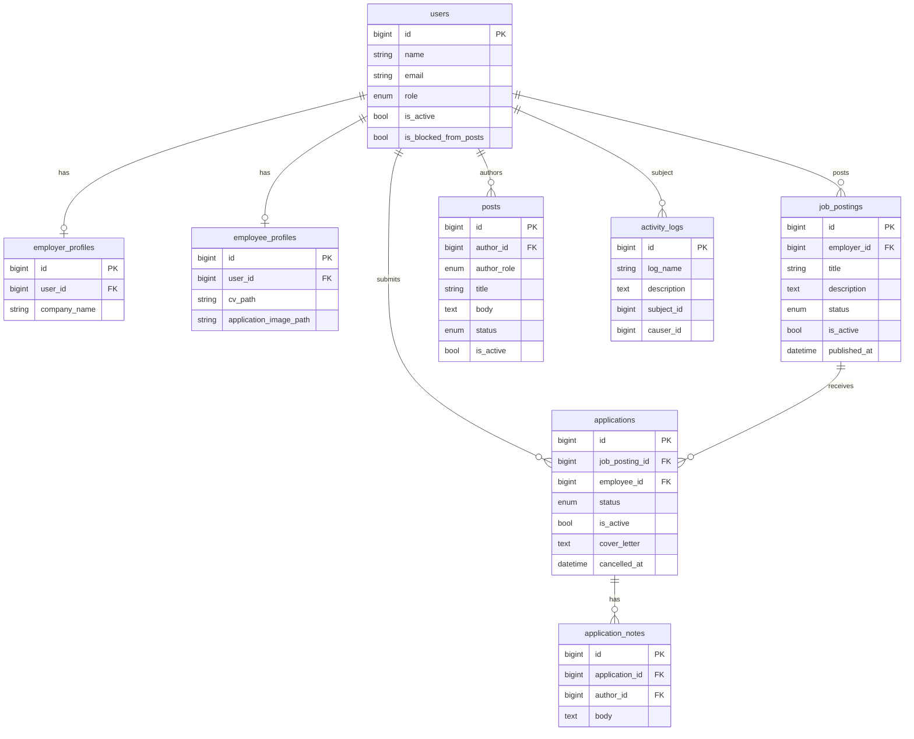
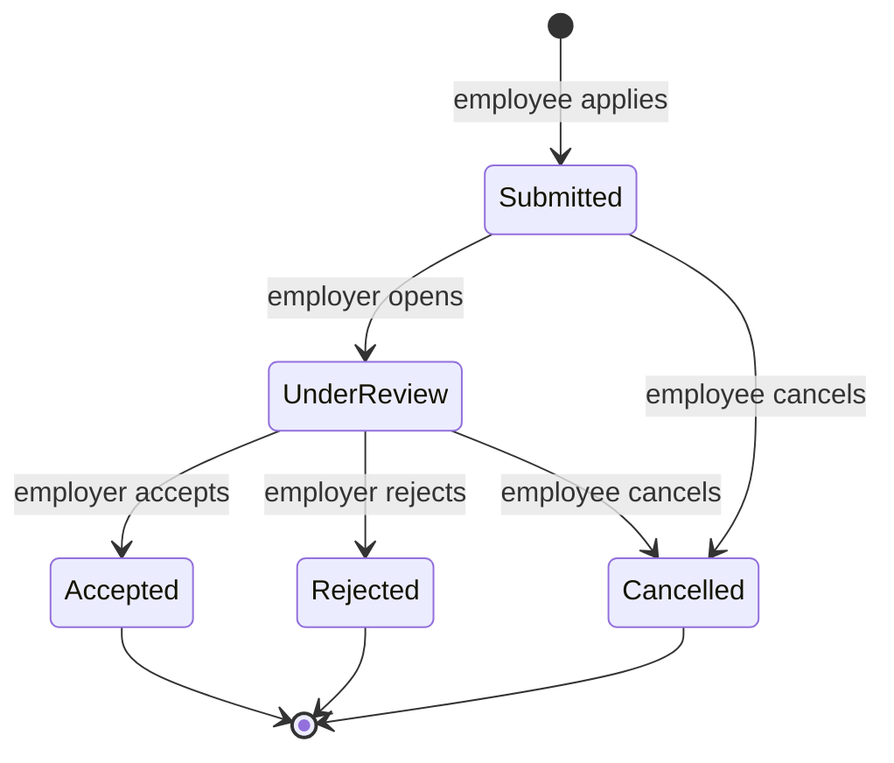
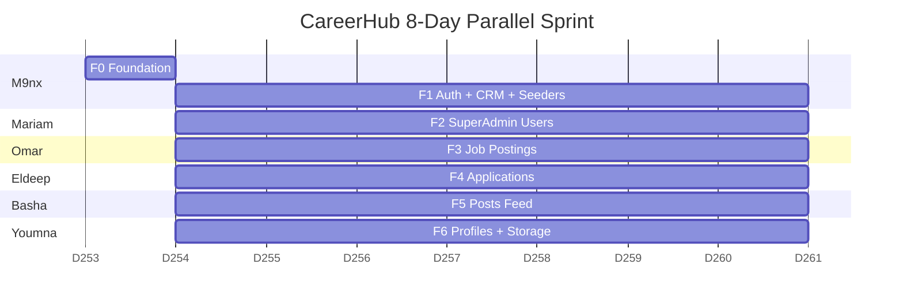
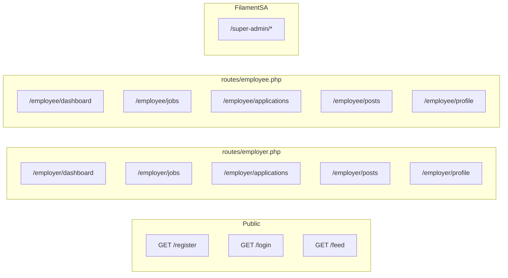

# CareerHub — Master Reference: Full Architecture & 8-Day WBS (v2)

> **Epic:** [#1](https://github.com/M9nx/CareerHub/issues/1) · **Team (6):** M9nx · Mariam · Omar · Eldeep · Basha · Youmna  
> **Repo:** [M9nx/CareerHub](https://github.com/M9nx/CareerHub) · `main` (protected)  
> **Stack:** Laravel **13.31** · PHP **8.5** · Filament **5.8** · Breeze **2.4** · Breezy **3.2** · Pest **5.1**

---

## 1. Locked product decisions

| # | Decision |
|---|----------|
| 1 | **Posts = shared feed** — Employer + Employee use the **same feed view**; SuperAdmin has a **separate moderation panel** (see/edit/delete/block user from posting) |
| 2 | **Registration open** for both **Employee** and **Employer** (role chosen at signup) |
| 3 | **Cancel = Withdrawn** — single terminal status: `Cancelled` (employee cancel action) |
| 4 | **SuperAdmin = Filament only** (`/super-admin`, isolated). **Employer + Employee = Breeze** (`/employer/*`, `/employee/*`). No Filament for end users |
| 5 | **Storage = local disk** (`storage/app/public`, symlink `public/storage`) — no S3 |
| 6 | **CRM expanded in scope** — activity log, notes on applications, audit trail for SuperAdmin (full 8-day deadline) |

---

## 2. Architecture

```mermaid
flowchart TB
    subgraph Auth["Breeze Auth (web guard)"]
        REG["/register<br/>role: Employer | Employee"]
        LOGIN["/login"]
    end

    subgraph SuperAdmin["Filament — isolated"]
        SA["/super-admin<br/>guard: filament"]
        SA --> SAUsers["UserResource"]
        SA --> SAJobs["JobPostingResource"]
        SA --> SAApps["ApplicationResource"]
        SA --> SAPosts["PostModerationResource"]
        SA --> SACRM["ActivityLog + Notes"]
    end

    subgraph Employer["Breeze — Employer"]
        EMP["/employer/dashboard"]
        EMP --> EMPJobs["Jobs CRUD"]
        EMP --> EMPApps["Applications review"]
        EMP --> EMPPosts["Posts + Feed"]
        EMP --> EMPProf["Profile + company"]
    end

    subgraph Employee["Breeze — Employee"]
        EE["/employee/dashboard"]
        EE --> EEJobs["Browse + Apply"]
        EE --> EEApps["My applications"]
        EE --> EEPosts["Posts + Feed"]
        EE --> EEProf["Profile + CV + app image"]
    end

    subgraph Shared["Shared domain layer"]
        DB[(SQLite/MySQL)]
        POL[Policies]
        SVC[Services / Actions]
    end

    REG --> EMP
    REG --> EE
    LOGIN --> EMP
    LOGIN --> EE
    LOGIN --> SA

    SA --> Shared
    EMP --> Shared
    EE --> Shared
    Shared --> DB
```



### Panel isolation rules

| Surface | Path prefix | Guard | Middleware | Who |
|---------|-------------|-------|------------|-----|
| SuperAdmin | `/super-admin` | `filament` | Filament auth + `EnsureSuperAdmin` | SuperAdmin only |
| Employer | `/employer` | `web` | `auth` + `EnsureEmployer` | Employer |
| Employee | `/employee` | `web` | `auth` + `EnsureEmployee` | Employee |
| Legacy `/admin` | — | — | **Remove** — merge into super-admin | — |

---

## 3. Data model (ER)



### Naming (avoid queue collision)

| Concept | Table | Model |
|---------|-------|-------|
| Job vacancy | `job_postings` | `JobPosting` |
| Application | `applications` | `Application` |
| Post | `posts` | `Post` |
| **NOT** | `jobs` | Laravel queue table |

### Enums (`app/Enums/`)

| File | Cases |
|------|-------|
| `UserRole.php` | `SuperAdmin`, `Employer`, `Employee` |
| `JobPostingStatus.php` | `Draft`, `Published`, `Closed`, `Archived` |
| `ApplicationStatus.php` | `Submitted`, `UnderReview`, `Accepted`, `Rejected`, `Cancelled` |
| `PostStatus.php` | `Draft`, `Published`, `Hidden`, `Archived` |

---

## 4. Application status state machine



---

## 5. WBS philosophy — feature slices, not layers

Each team member owns **one feature end-to-end** across the full Laravel lifecycle:

```
migration → enum → model → factory → policy → controller → form request → blade views → routes → notification → pest tests → seeder slice
```

**No one waits on a separate "UI person" or "DB person."**  
**Day 1 only:** M9nx merges **F0 Foundation** (~4h) so all features share contracts. After F0 merges, **6 features run in parallel** (Days 1 PM → 8).

---

## 6. Parallel feature ownership



| Feature ID | Feature name | Owner | Branch | Depends on |
|------------|--------------|-------|--------|------------|
| **F0** | Platform foundation | **M9nx** | `feature/f0-platform-foundation` | — (merge first) |
| **F1** | Auth, registration, CRM activity log | **M9nx** | `feature/f1-auth-crm-activity-log` | F0 |
| **F2** | SuperAdmin user management | **Mariam** | `feature/f2-superadmin-users` | F0 |
| **F3** | Job postings (all personas) | **Omar** | `feature/f3-job-postings` | F0 |
| **F4** | Applications workflow | **Eldeep** | `feature/f4-applications` | F0 |
| **F5** | Posts + shared feed + moderation | **Basha** | `feature/f5-posts-feed` | F0 |
| **F6** | Profiles + local file uploads | **Youmna** | `feature/f6-profiles-storage` | F0 |

---

## 7. Feature deliverables (full lifecycle per owner)

### F0 — Platform foundation (M9nx · Day 1 AM · merge before noon)

| Layer | Deliverable |
|-------|-------------|
| Migration | `2026_09_10_000001_add_role_and_status_to_users_table.php` — `role`, `is_active`, `is_blocked_from_posts` |
| Enum | `app/Enums/UserRole.php` |
| Model | Update `app/Models/User.php` — `canAccessPanel()`, role casts |
| Middleware | `EnsureSuperAdmin`, `EnsureEmployer`, `EnsureEmployee` |
| Provider | Fix `SuperAdminPanelProvider.php` → id `super-admin`, path `/super-admin`, login, guard `filament`, Breezy |
| Provider | Remove/deprecate `AdminPanelProvider.php` |
| Config | `config/filesystems.php` — `public` disk for uploads |
| Test | `tests/Feature/Middleware/RoleMiddlewareTest.php` |
| Test | `tests/Feature/Panel/SuperAdminPanelAccessTest.php` |

**Branch:** `feature/f0-platform-foundation`  
**PR title:** `[F0] Platform foundation — roles, middleware, super-admin panel`

---

### F1 — Auth, registration, CRM (M9nx · Days 1 PM–8)

| Layer | Deliverable |
|-------|-------------|
| Controller | `RegisteredUserController` — role picker (Employer / Employee) |
| View | `resources/views/auth/register.blade.php` — role field |
| Migration | `2026_09_10_000007_create_activity_logs_table.php` |
| Migration | `2026_09_10_000008_create_application_notes_table.php` |
| Model | `ActivityLog.php`, `ApplicationNote.php` |
| Filament | `SuperAdmin/Resources/ActivityLogResource.php` |
| Filament | Relation manager: notes on `ApplicationResource` (pairs with F4) |
| Service | `app/Services/ActivityLogger.php` |
| Seeder | `CareerHubDemoSeeder.php` — 6 demo users, sample data hooks |
| Test | `tests/Feature/Auth/RegistrationRoleTest.php` |
| Test | `tests/Feature/Crm/ActivityLogTest.php` |

**Branch:** `feature/f1-auth-crm-activity-log`

---

### F2 — SuperAdmin users (Mariam · Days 1 PM–8)

| Layer | Deliverable |
|-------|-------------|
| Policy | `app/Policies/UserPolicy.php` |
| Filament | `SuperAdmin/Resources/UserResource.php` + List/Create/Edit pages |
| Actions | Activate, deactivate, change role |
| Gate | `AppServiceProvider` — SuperAdmin bypass |
| Test | `tests/Feature/SuperAdmin/UserManagementTest.php` |

**Branch:** `feature/f2-superadmin-users`

---

### F3 — Job postings (Omar · Days 1 PM–8)

| Layer | Deliverable |
|-------|-------------|
| Migration | `2026_09_10_000004_create_job_postings_table.php` |
| Enum | `JobPostingStatus.php` |
| Model | `JobPosting.php` + factory |
| Policy | `JobPostingPolicy.php` |
| Filament | `SuperAdmin/Resources/JobPostingResource.php` |
| Controller | `Employer/JobPostingController.php` — CRUD |
| Controller | `Employee/JobBrowseController.php` — read published |
| Views | `resources/views/employer/jobs/*`, `resources/views/employee/jobs/*` |
| Routes | `routes/employer.php`, `routes/employee.php` |
| FormRequest | `StoreJobPostingRequest`, `UpdateJobPostingRequest` |
| Test | `tests/Feature/JobPosting/EmployerJobPostingTest.php` |
| Test | `tests/Feature/JobPosting/EmployeeJobBrowseTest.php` |

**Branch:** `feature/f3-job-postings`

---

### F4 — Applications (Eldeep · Days 1 PM–8)

| Layer | Deliverable |
|-------|-------------|
| Migration | `2026_09_10_000005_create_applications_table.php` |
| Enum | `ApplicationStatus.php` |
| Model | `Application.php` + factory |
| Policy | `ApplicationPolicy.php` |
| Action | `app/Actions/CancelApplication.php` |
| Action | `app/Actions/TransitionApplicationStatus.php` |
| Filament | `SuperAdmin/Resources/ApplicationResource.php` |
| Controller | `Employer/ApplicationController.php` — review + status |
| Controller | `Employee/ApplicationController.php` — apply, cancel, trace |
| Notification | `ApplicationStatusChangedNotification.php` |
| Views | employer + employee application blades + status timeline partial |
| Test | `tests/Feature/Application/ApplicationWorkflowTest.php` |
| Test | `tests/Feature/Application/EmployeeCancelTest.php` |

**Branch:** `feature/f4-applications`

---

### F5 — Posts + shared feed (Basha · Days 1 PM–8)

| Layer | Deliverable |
|-------|-------------|
| Migration | `2026_09_10_000006_create_posts_table.php` |
| Enum | `PostStatus.php` |
| Model | `Post.php` + factory |
| Policy | `PostPolicy.php` |
| Controller | `FeedController.php` — **shared** `/feed` for Employer + Employee |
| Controller | `Employer/PostController.php`, `Employee/PostController.php` — own CRUD |
| Filament | `SuperAdmin/Resources/PostModerationResource.php` — all posts, block user |
| Action | `BlockUserFromPosts.php` — sets `users.is_blocked_from_posts` |
| Views | `resources/views/feed/index.blade.php`, post forms |
| Test | `tests/Feature/Post/SharedFeedTest.php` |
| Test | `tests/Feature/Post/AdminModerationTest.php` |

**Branch:** `feature/f5-posts-feed`

---

### F6 — Profiles + uploads (Youmna · Days 1 PM–8)

| Layer | Deliverable |
|-------|-------------|
| Migration | `2026_09_10_000002_create_employer_profiles_table.php` |
| Migration | `2026_09_10_000003_create_employee_profiles_table.php` |
| Model | `EmployerProfile.php`, `EmployeeProfile.php` + factories |
| Controller | `Employer/ProfileController.php` — company name |
| Controller | `Employee/ProfileController.php` — CV + application image |
| FormRequest | `UpdateEmployerProfileRequest`, `UpdateEmployeeProfileRequest` |
| Service | `app/Services/LocalDocumentStorage.php` — disk `public` |
| Views | profile edit blades with file upload |
| Test | `tests/Feature/Profile/EmployerProfileTest.php` |
| Test | `tests/Feature/Profile/EmployeeCvUploadTest.php` |

**Branch:** `feature/f6-profiles-storage`

---

## 8. Route map



Register in `bootstrap/app.php`:
```php
->withRouting(
    web: __DIR__.'/../routes/web.php',
    then: function () {
        Route::middleware(['web', 'auth', 'employer'])->prefix('employer')->group(base_path('routes/employer.php'));
        Route::middleware(['web', 'auth', 'employee'])->prefix('employee')->group(base_path('routes/employee.php'));
    },
)
```

---

## 9. Packages

| Package | Status | Owner feature |
|---------|--------|---------------|
| `laravel/framework` ^13.17 | installed | all |
| `filament/filament` ^5.8 | installed | F0, F2–F5 (SuperAdmin only) |
| `jeffgreco13/filament-breezy` ^3.2 | installed | F0 (SuperAdmin profile) |
| `laravel/breeze` ^2.4 | installed | F1, F3–F6 |
| `pestphp/pest` ^5.1 | installed | all |
| `spatie/laravel-activitylog` ^4 | **add in F1** | F1 CRM |

---

## 10. Day-by-day merge targets

| Day | Expected merges to `main` |
|-----|---------------------------|
| **D1** | **F0** (required). Start F1–F6 branches |
| **D2** | F6 profiles (low coupling), F2 users |
| **D3** | F3 jobs schema + employer UI |
| **D4** | F4 applications |
| **D5** | F5 posts + feed |
| **D6** | F1 registration + activity log |
| **D7** | Integration fixes, cross-feature PR reviews |
| **D8** | F1 demo seeder, full suite green, demo script |

---

## 11. Definition of done (every feature PR)

- [ ] Migration runs `php artisan migrate`
- [ ] Factory + at least 1 Pest feature test passes
- [ ] Policy enforced (403 for wrong role)
- [ ] Pint clean: `vendor/bin/pint --dirty`
- [ ] No direct push to `main` — PR + CODEOWNERS approval
- [ ] PR links feature ID: `[F3] ...`

---

## 12. Child issues checklist

- [ ] **F0** Platform foundation — M9nx
- [ ] **F1** Auth + CRM activity log — M9nx
- [ ] **F2** SuperAdmin users — Mariam
- [ ] **F3** Job postings — Omar
- [ ] **F4** Applications — Eldeep
- [ ] **F5** Posts + shared feed — Basha
- [ ] **F6** Profiles + local storage — Youmna

---

## 13. Current repo gaps

- [ ] `SuperAdminPanelProvider` — invalid slug `super Admin`
- [ ] `canAccessPanel()` — `@gmail.com` placeholder
- [ ] No domain models, policies, or Breeze persona routes
- [ ] `jobs` table = queue — use `job_postings`
