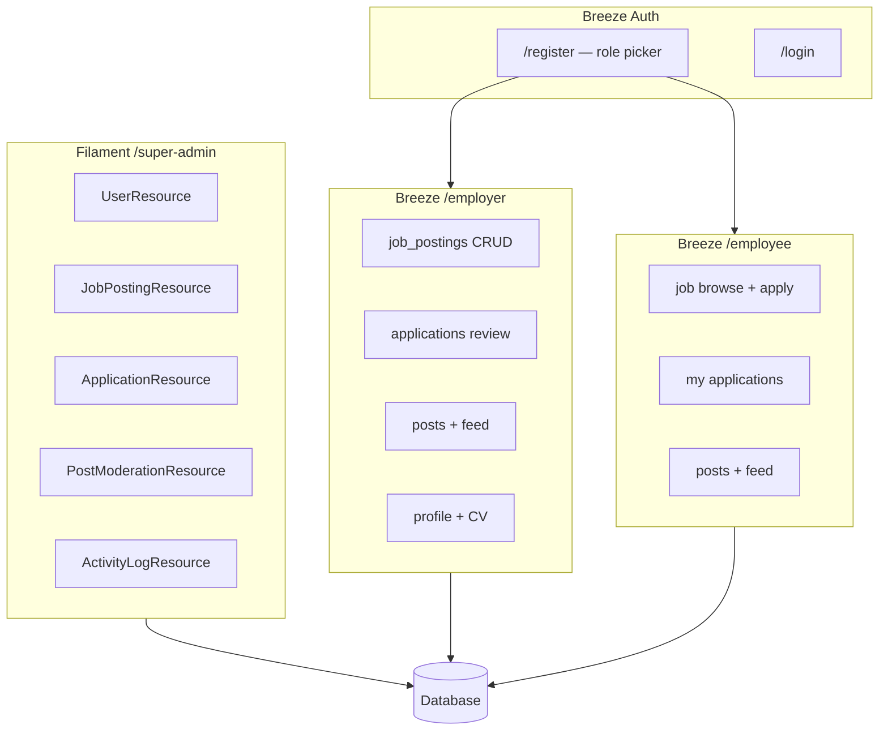

# CareerHub — Master Control Issue (WBS v2)

> **Epic / Master:** [#1](https://github.com/M9nx/CareerHub/issues/1)  
> **Repo:** [M9nx/CareerHub](https://github.com/M9nx/CareerHub) · Branch: `main` (protected)  
> **Stack:** Laravel **13** · PHP **8.5** · Filament **5** · Breeze **2.4** · Pest **5**  
> **Sprint:** 8 days · 6 members · 48 leaf packages (8 hours each)

---

## 1. Team roster

| Member | Primary feature thread |
|--------|------------------------|
| **M9nx** | Foundation, Auth, CRM, Integration |
| **Mariam** | SuperAdmin Users + Filament platform |
| **Omar** | Job postings (`job_postings` table) |
| **Eldeep** | Applications workflow |
| **Basha** | Posts shared feed + moderation |
| **Youmna** | Profiles + local storage |

---

## 2. Locked product decisions

| # | Decision |
|---|----------|
| 1 | **Posts = shared feed** — Employer + Employee share `/feed`; SuperAdmin moderates via Filament |
| 2 | **Open registration** for **Employer** and **Employee** (role at signup) |
| 3 | **Cancel = `Cancelled` status** — employee cancel action sets terminal `Cancelled` |
| 4 | **SuperAdmin = Filament only** at `/super-admin`; Employer `/employer/*`; Employee `/employee/*` |
| 5 | **Storage = local disk** (`storage/app/public`, `public/storage` symlink) |
| 6 | **CRM in scope** — activity log, application notes, SuperAdmin audit trail |

---

## 3. Architecture summary



**Table naming:** use `job_postings` (not `jobs` — Laravel queue table).

---

## 4. WBS hierarchy (Cafeteria pattern)

```
Master #1
├── Phase P0 #9 — Day 1 Foundation
│   ├── P0-M9nx #10
│   ├── P0-Mariam #11
│   ├── P0-Omar #12
│   ├── P0-Eldeep #13
│   ├── P0-Basha #14
│   └── P0-Youmna #15
├── Phase P1 #16 — Day 2 Auth+Registration
│   └── … (6 leaves)
├── Phase P2 #23 — Day 3 SuperAdmin Users+CRM
├── Phase P3 #30 — Day 4 Job Postings
├── Phase P4 #37 — Day 5 Applications
├── Phase P5 #44 — Day 6 Posts Feed+Moderation
├── Phase P6 #51 — Day 7 Profiles+Storage
└── Phase P7 #58 — Day 8 Integration QA Release
```

Each **leaf** is one 8-hour vertical slice spanning migration → model → policy → controller/resource → views → tests for that day's scope.

---

## 5. Live control index — phases

| Phase | Issue | Day | Title | Leaf issues | Status |
|-------|-------|-----|-------|-------------|--------|
| P0 | #9 | Day 1 | Foundation and Governance | #10, #11, #12, #13, #14, #15 | not-started |
| P1 | #16 | Day 2 | Authentication and Registration | #17, #18, #19, #20, #21, #22 | not-started |
| P2 | #23 | Day 3 | SuperAdmin Users and CRM | #24, #25, #26, #27, #28, #29 | not-started |
| P3 | #30 | Day 4 | Job Postings | #31, #32, #33, #34, #35, #36 | not-started |
| P4 | #37 | Day 5 | Applications | #38, #39, #40, #41, #42, #43 | not-started |
| P5 | #44 | Day 6 | Posts Feed and Moderation | #45, #46, #47, #48, #49, #50 | not-started |
| P6 | #51 | Day 7 | Profiles and Storage | #52, #53, #54, #55, #56, #57 | not-started |
| P7 | #58 | Day 8 | Integration QA and Release | #59, #60, #61, #62, #63, #64 | not-started |

---

## 6. Live control index — all leaves

| WBS ID | Issue | Owner | Phase | Branch | Dependencies | Status |
|--------|-------|-------|-------|--------|--------------|--------|
| P0-M9nx | #10 | M9nx | P0 | `feat/#10-foundation-governance` | - | not-started |
| P0-Mariam | #11 | Mariam | P0 | `feat/#11-user-role-schema` | P0-M9nx | not-started |
| P0-Omar | #12 | Omar | P0 | `feat/#12-employer-route-shell` | P0-Mariam | not-started |
| P0-Eldeep | #13 | Eldeep | P0 | `feat/#13-employee-route-shell` | P0-Mariam | not-started |
| P0-Basha | #14 | Basha | P0 | `feat/#14-persona-navigation` | P0-Omar, P0-Eldeep | not-started |
| P0-Youmna | #15 | Youmna | P0 | `feat/#15-foundation-tests` | P0-M9nx, P0-Mariam, P0-Omar, P0-Eldeep | not-started |
| P1-M9nx | #17 | M9nx | P1 | `feat/#17-auth-registration-role` | P0-Mariam | not-started |
| P1-Mariam | #18 | Mariam | P1 | `feat/#18-user-policy-bootstrap` | P0-Mariam | not-started |
| P1-Omar | #19 | Omar | P1 | `feat/#19-job-postings-schema` | P0-Mariam | not-started |
| P1-Eldeep | #20 | Eldeep | P1 | `feat/#20-applications-schema` | P1-Omar | not-started |
| P1-Basha | #21 | Basha | P1 | `feat/#21-posts-schema` | P0-Mariam | not-started |
| P1-Youmna | #22 | Youmna | P1 | `feat/#22-profiles-schema` | P0-Mariam | not-started |
| P2-M9nx | #24 | M9nx | P2 | `feat/#24-crm-activity-log` | P1-M9nx | not-started |
| P2-Mariam | #25 | Mariam | P2 | `feat/#25-superadmin-user-resource` | P1-Mariam | not-started |
| P2-Omar | #26 | Omar | P2 | `feat/#26-job-posting-policy-sa` | P1-Omar | not-started |
| P2-Eldeep | #27 | Eldeep | P2 | `feat/#27-application-policy-bootstrap` | P1-Eldeep | not-started |
| P2-Basha | #28 | Basha | P2 | `feat/#28-post-policy-block-flag` | P1-Basha | not-started |
| P2-Youmna | #29 | Youmna | P2 | `feat/#29-local-storage-service` | P1-Youmna | not-started |
| P3-M9nx | #31 | M9nx | P3 | `feat/#31-crm-job-posting-events` | P2-M9nx, P3-Omar | not-started |
| P3-Mariam | #32 | Mariam | P3 | `feat/#32-sa-job-posting-actions` | P2-Omar | not-started |
| P3-Omar | #33 | Omar | P3 | `feat/#33-employer-job-posting-crud` | P2-Omar | not-started |
| P3-Eldeep | #34 | Eldeep | P3 | `feat/#34-employee-job-browse` | P3-Omar | not-started |
| P3-Basha | #35 | Basha | P3 | `feat/#35-feed-route-shell` | P2-Basha | not-started |
| P3-Youmna | #36 | Youmna | P3 | `feat/#36-employer-profile-edit` | P2-Youmna, P1-Youmna | not-started |
| P4-M9nx | #38 | M9nx | P4 | `feat/#38-crm-application-notes` | P2-M9nx, P4-Eldeep | not-started |
| P4-Mariam | #39 | Mariam | P4 | `feat/#39-sa-block-from-posts` | P2-Mariam | not-started |
| P4-Omar | #40 | Omar | P4 | `feat/#40-employer-job-transitions` | P3-Omar | not-started |
| P4-Eldeep | #41 | Eldeep | P4 | `feat/#41-applications-workflow` | P2-Eldeep, P3-Eldeep | not-started |
| P4-Basha | #42 | Basha | P4 | `feat/#42-persona-post-crud` | P3-Basha | not-started |
| P4-Youmna | #43 | Youmna | P4 | `feat/#43-employee-profile-edit-base` | P3-Youmna | not-started |
| P5-M9nx | #45 | M9nx | P5 | `feat/#45-crm-post-moderation-log` | - | not-started |
| P5-Mariam | #46 | Mariam | P5 | `feat/#46-sa-post-moderation` | P4-Mariam, P2-Basha | not-started |
| P5-Omar | #47 | Omar | P5 | `feat/#47-employee-apply-ui` | P4-Eldeep, P3-Eldeep | not-started |
| P5-Eldeep | #48 | Eldeep | P5 | `feat/#48-application-notifications` | P4-Eldeep | not-started |
| P5-Basha | #49 | Basha | P5 | `feat/#49-shared-feed-complete` | P4-Basha | not-started |
| P5-Youmna | #50 | Youmna | P5 | `feat/#50-employee-cv-upload` | P2-Youmna, P4-Youmna | not-started |
| P6-M9nx | #52 | M9nx | P6 | `feat/#52-demo-seeder` | - | not-started |
| P6-Mariam | #53 | Mariam | P6 | `feat/#53-sa-dashboard-widgets` | P5-Mariam | not-started |
| P6-Omar | #54 | Omar | P6 | `feat/#54-employee-job-filters` | P5-Omar | not-started |
| P6-Eldeep | #55 | Eldeep | P6 | `feat/#55-application-timeline` | P5-Eldeep | not-started |
| P6-Basha | #56 | Basha | P6 | `feat/#56-feed-blocked-user-ux` | P5-Basha | not-started |
| P6-Youmna | #57 | Youmna | P6 | `feat/#57-profile-download-docs` | P5-Youmna | not-started |
| P7-M9nx | #59 | M9nx | P7 | `feat/#59-integration-release` | - | not-started |
| P7-Mariam | #60 | Mariam | P7 | `feat/#60-sa-regression-audit` | P6-Mariam | not-started |
| P7-Omar | #61 | Omar | P7 | `feat/#61-jobs-e2e-regression` | P6-Omar | not-started |
| P7-Eldeep | #62 | Eldeep | P7 | `feat/#62-applications-e2e-regression` | P6-Eldeep | not-started |
| P7-Basha | #63 | Basha | P7 | `feat/#63-posts-e2e-regression` | P6-Basha | not-started |
| P7-Youmna | #64 | Youmna | P7 | `feat/#64-profiles-e2e-regression` | P6-Youmna | not-started |

---

## 7. Phase appendices (file contracts)

| Phase | Appendix file | Day | Title |
|-------|---------------|-----|-------|
| P0 | [P0.md](./P0.md) | 1 | Foundation and Governance |
| P1 | [P1.md](./P1.md) | 2 | Authentication and Registration |
| P2 | [P2.md](./P2.md) | 3 | SuperAdmin Users and CRM |
| P3 | [P3.md](./P3.md) | 4 | Job Postings |
| P4 | [P4.md](./P4.md) | 5 | Applications |
| P5 | [P5.md](./P5.md) | 6 | Posts Feed and Moderation |
| P6 | [P6.md](./P6.md) | 7 | Profiles and Storage |
| P7 | [P7.md](./P7.md) | 8 | Integration QA and Release |

---

## 8. Workflow gates (every leaf)

### Learning Gate
- [ ] Prerequisites reviewed and linked as learning evidence
- [ ] Dependencies merged or handoff approved
- [ ] Status: `READY` before coding

### Delivery Gate
- [ ] All file contracts in phase appendix satisfied
- [ ] `vendor/bin/pint --dirty` clean on PHP changes
- [ ] Targeted Pest tests pass
- [ ] PR opened with `Closes #LEAF_…` and reviewers requested

### Review Gate
- [ ] M9nx + Mariam approved (or delegated)
- [ ] Integrated on `main` and smoke-tested

---

## 9. Definition of done (every PR)

- [ ] Migration runs: `php artisan migrate`
- [ ] Factory + Pest feature test(s) pass for owned slice
- [ ] Policy enforced (403 for wrong role)
- [ ] No direct push to `main`
- [ ] PR title includes WBS ID: `[P3-Omar] …`

---

## 10. Domain products in scope

| Product | Table | SuperAdmin | Employer | Employee |
|---------|-------|------------|----------|----------|
| Users | `users` | CRUD | — | — |
| Job postings | `job_postings` | view/manage | CRUD | browse |
| Applications | `applications` | view + notes | review | apply, cancel |
| Posts | `posts` | moderate | CRUD + feed | CRUD + feed |
| Profiles | `employer_profiles`, `employee_profiles` | — | company | CV + image |
| CRM | `activity_logs`, `application_notes` | full | — | — |

---

## 11. Current repo gaps (Day 0)

- [ ] `SuperAdminPanelProvider` — invalid slug `super Admin` → fix to `super-admin`
- [ ] `canAccessPanel()` — `@gmail.com` placeholder → use `UserRole::SuperAdmin`
- [ ] No persona routes, domain models, or policies yet
- [ ] Queue `jobs` table exists — never use for vacancies

---

## 12. Related references

- [MASTER-WBS-v2.md](../MASTER-WBS-v2.md) — architecture deep-dive
- Phase appendices: [P0](./P0.md) · [P1](./P1.md) · [P2](./P2.md) · [P3](./P3.md) · [P4](./P4.md) · [P5](./P5.md) · [P6](./P6.md) · [P7](./P7.md)
- Issue hierarchy is tracked via GitHub **sub-issues** on this master issue and each phase issue (sections 5–6 list all issue numbers).

